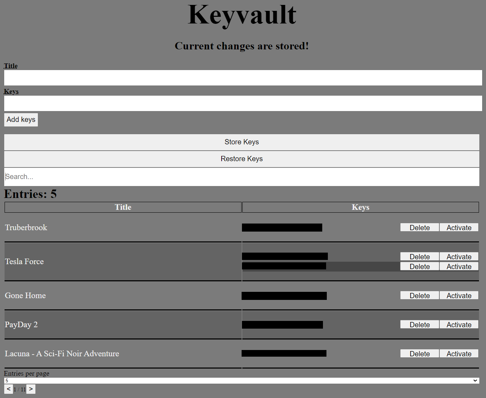

# Keyvault

This is a simple backend + website to store keys.

For example you can store keys for shops on this website.

This project was a small project I did to better keep track of my unused Steam keys therefor its not beautiful but everything should function.

## Disclaimer

Do NOT use this project on an webserver that is visible to the outsite. This project has no authentication built in. Therefor everyone with access to the site is able to see every key!

***I do NOT take responsibility for any damage or illegal use of this site!***

## Requirements

- Node.js
- NPM (Node package manager)

## Installation

Download the zip (Source Code) of this project [here](https://github.com/VeenixDev/KeyVault/releases).

Unzip the file and start the `start.bat`.

## Usage

You can start the website and server via `node run start`.

If you wish to start it in development mode use `node run start:dev`

You can see the site under `http://localhost:3000` (uncached website `http://localhost:3000?dev=true`)

For Windows you can use the `start.bat` to start the server. This script starts the server and opens your default browser with the website open!

## Website

The "Activate" button takes you directly to the steam-key-activation page with the key put in.

You can add keys to the site. After adding all keys you have to manually store the keys by pressing on the "Store Keys" button. If not stored and the server is shut down the newly added keys aren't stored!  
If you added a key and didn't already save you can undo all changes by clicking on "Restore Keys" (**The restore button does not recover any deleted key. It only discards any newly added keys**)

